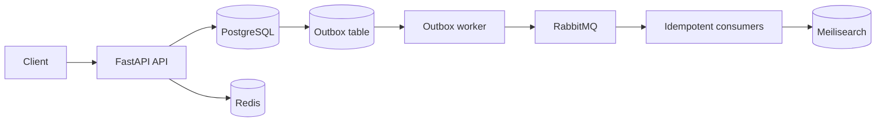

# Bookshop API

[](https://github.com/alirezamoradkhani/bookshop/actions/workflows/ci.yml)
[](https://www.python.org/downloads/release/python-3110/)
[](https://fastapi.tiangolo.com/)
[](LICENSE)

An event-driven FastAPI backend for a digital bookshop. The project explores
reliability patterns used in real backend systems: transactional outbox,
idempotent commands, asynchronous consumers, database-backed domain workflows,
and a dedicated search read model.

## Why this project exists

Bookshop is a portfolio project focused on the engineering problems behind a
non-trivial API—not only CRUD endpoints. It models purchasing, borrowing,
inventory, wallet transactions, waitlists, search indexing, and asynchronous
event processing while keeping PostgreSQL as the source of truth.

## Architecture



The application is a modular monolith with background workers. A business
transaction and its outgoing event are written together. The outbox worker
then publishes committed events to RabbitMQ, where consumers update downstream
workflows and the Meilisearch read model.

## Key features

- JWT authentication and role-aware user flows
- Book, author, category, and edition management
- Orders with wallet and inventory updates
- Borrowing, due dates, overdue handling, and waitlists
- Transactional outbox for reliable event publication
- RabbitMQ consumers for asynchronous workflows
- Redis-backed idempotency, OTP storage, and rate limiting
- Meilisearch full-text search with filtering and typo tolerance
- Alembic migrations and database integrity constraints
- Analytics queries for sales, borrowing, users, and authors

## Technology

- Python 3.11 and FastAPI
- PostgreSQL 16, SQLAlchemy 2, and Alembic
- Redis 7
- RabbitMQ and `aio-pika`
- Meilisearch
- APScheduler
- Docker Compose

## Project structure

```text
app/
├── api/                    API router composition
├── book/                   Catalog domain
├── borrow/                 Borrowing and waitlist workflows
├── edition/                Inventory and edition management
├── order/                  Order lifecycle
├── transaction/            Wallet operations and audit records
├── user/                   Authentication and identity
├── outbox/                 Transactional event publication
├── workers/                Consumers and scheduled jobs
├── search/                 Meilisearch read model
├── analytics/              Business reports
├── dependency_injection/   Dependency providers
└── core/                   Configuration, security, and database
```

## Run with Docker

Requirements: Docker with the Compose plugin.

```bash
git clone https://github.com/alirezamoradkhani/bookshop.git
cd bookshop
cp .env.example .env
docker compose up --build
```

The stack starts the API, PostgreSQL, Redis, RabbitMQ, Meilisearch, the outbox
publisher, event consumers, and scheduled jobs.

Useful endpoints:

| Service | URL |
| --- | --- |
| API | <http://localhost:8000> |
| Swagger UI | <http://localhost:8000/docs> |
| ReDoc | <http://localhost:8000/redoc> |
| Health check | <http://localhost:8000/health> |
| RabbitMQ management | <http://localhost:15672> |
| Meilisearch | <http://localhost:7700> |

The values in `.env.example` are development-only placeholders. Replace every
secret before using the application outside a local environment.

## Run locally

Use Python 3.11 and provide reachable PostgreSQL, Redis, RabbitMQ, and
Meilisearch instances in `.env`.

```powershell
python -m venv .venv
.\.venv\Scripts\Activate.ps1
python -m pip install --upgrade pip
python -m pip install -r requirements.txt
alembic upgrade head
python -m uvicorn app.main:app --reload
```

Start workers in separate terminals when their backing services are available:

```powershell
python -m app.workers.outbox_worker
python -m app.workers.start_consumers
python -m app.workers.scheduler_worker
```

## Run tests

After installing the dependencies and configuring `.env`:

```bash
python -m unittest discover -s tests -v
```

The current test suite covers authentication helpers, financial invariants,
order creation, borrowing rules, inventory mutation, event creation, search
helpers, and idempotency locking. Database and broker integration coverage is a
planned next step.

## Reliability decisions

### Transactional outbox

Business changes and outgoing events are persisted in the same PostgreSQL
transaction. This avoids losing an event after committing domain state.

### Idempotency

Redis-backed locks and cached results protect retryable commands from duplicate
execution. Lock release verifies ownership so one request cannot release
another request's lock.

### Database invariants

Database constraints protect non-negative wallet balances and inventory.
Service-level checks provide useful domain errors, while database constraints
remain the final safety boundary.

### Search as a read model

PostgreSQL remains the source of truth. Meilisearch is updated asynchronously
and can be rebuilt from domain data when required.

## Current limitations

This is an actively developed portfolio system. Before production use it still
needs broader integration testing, secret management, tracing and metrics,
backup and recovery procedures, container hardening, and a real deployment
environment.

## Roadmap

- PostgreSQL, Redis, and RabbitMQ integration tests
- Concurrency tests for inventory and wallet updates
- OpenTelemetry tracing and Prometheus metrics
- Production container configuration
- Load testing with published latency results
- Payment provider integration

## Documentation

- [`docs/PRODUCT_BUSINESS_PLAN.md`](docs/PRODUCT_BUSINESS_PLAN.md) — product model and launch plan
- [`docs/CUSTOMER_JOURNEYS.md`](docs/CUSTOMER_JOURNEYS.md) — end-to-end acceptance criteria
- [`docs/TESTING.md`](docs/TESTING.md) — testing strategy
- [`docs/PRODUCTION_REFACTOR_PLAN.md`](docs/PRODUCTION_REFACTOR_PLAN.md) — hardening plan

## Author

**Alireza Moradkhani** — Backend developer focused on Python, FastAPI,
PostgreSQL, asynchronous systems, and reliability engineering.

GitHub: <https://github.com/alirezamoradkhani>

## License

Released under the [MIT License](LICENSE).
